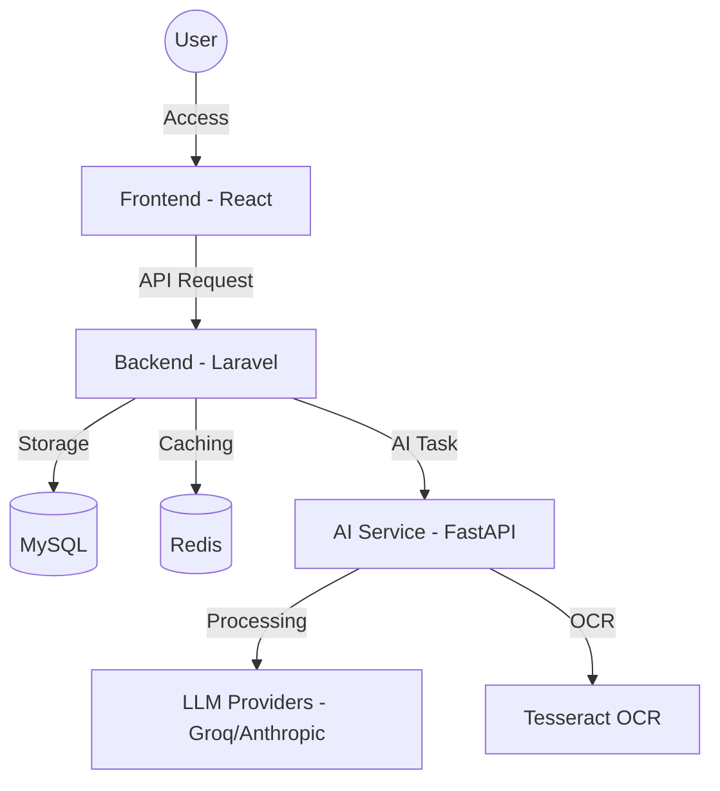

# 🌌 ChatID / Architect AI Platform

ChatID is a modern conversational AI platform that combines an intelligent chat interface with a powerful management Dashboard. The project is designed to provide a smooth AI experience, supporting multiple models and deep integration into user workflows.

---

## 🚀 Project Overview

ChatID is more than just a simple chat application. It is a complete ecosystem including:

- **Premium Chat Interface**: Supports Markdown, code highlighting, file/image uploads, and real-time web search.
- **Dashboard System**: Monitors performance, usage traffic, and analyzes user behavior with intuitive charts.
- **Flexible AI Management**: Allows configuration of multiple AI providers (Groq, Anthropic, ...) and easy management of API Keys.
- **Performance Optimization**: Uses Redis for caching and ensures the fastest response speeds.

---

## 🏗️ System Architecture

The system is built on a simple microservices architecture, separating the interface, business logic, and AI processing.

### High-Level Architecture Diagram



### Chi tiết các thành phần:

1.  **Frontend (React)**:
    - Uses React combined with modern UI libraries.
    - Manages application state, displays messages, and dashboard charts.
2.  **Backend (Laravel)**:
    - Acts as an API Gateway and handles core business logic (Auth, Database, Logging).
    - Manages access control (Sanctum) and coordinates requests to the AI Service.
3.  **AI Service (FastAPI)**:
    - A high-performance Python service specialized in processing AI tasks.
    - Integrates LangChain/LlamaIndex to interact with LLMs.
    - Supports file processing, image processing (OCR), and web scraping.

---

## 🔄 How It Works?

### 1. Message Processing Flow (Chat Flow)

- **Step 1**: User sends a message from the Frontend.
- **Step 2**: Backend receives the request, checks permissions, and saves the message to MySQL.
- **Step 3**: Backend sends the request to the AI Service via HTTP protocol.
- **Step 4**: AI Service processes the content (OCR for files or web search if needed), then calls the LLM API.
- **Step 5**: Results are returned through AI Service -> Backend -> Frontend and displayed to the user.

### 2. Dashboard Data Flow

- All user activities (sending messages, logging in, changing settings) are recorded by the Backend in `activity_logs`.
- When the user accesses the Dashboard, the Backend calculates metrics (Response Time, Success Rate, ...) and returns data for ApexCharts on the Frontend.

---

## 🛠️ Environment Requirements

- **PHP**: 8.2+ (Composer included)
- **Node.js**: 18+ (npm or yarn)
- **Python**: 3.10+ (pip)
- **Database**: MySQL 8.0+ & Redis
- **Additional Tools**: Tesseract OCR (if using OCR), Docker (optional)

---

## 💻 Installation Guide

### Method 1: Quick Run with Docker (Recommended)

```bash
docker-compose up --build
```

Hệ thống sẽ tự động khởi tạo Frontend (3000), Backend (8000) và AI Service (8001).

### Method 2: Manual Installation on Windows

We provide utility scripts to help you get started quickly:

1.  **Install Dependencies**:
    ```bash
    # Run setup script (if available) or install manually:
    cd BackEnd && composer install
    cd ../frontend && npm install
    cd ../ai_service && pip install -r requirements.txt
    ```
2.  **Configure .env**: Copy the `.env.example` files to `.env` in all 3 directories and fill in the necessary information (API Keys, Database config).
3.  **Launch**:
    ```bash
    # Use the combined script
    .\start-all.bat
    ```

---

## 📊 Thông số Cổng (Default Ports)

| Thành phần      | URL / Port                           |
| :-------------- | :----------------------------------- |
| **Frontend**    | `http://localhost:3000`              |
| **Backend API** | `http://localhost:8000`              |
| **AI Service**  | `http://localhost:8001`              |
| **MySQL**       | `3306` (hoặc `3307` nếu dùng Docker) |
| **Redis**       | `6379`                               |

---

## 📝 Giấy phép

Dự án được phát triển bởi **Architect AI Team**. Vui lòng liên hệ để biết thêm chi tiết về bản quyền.
