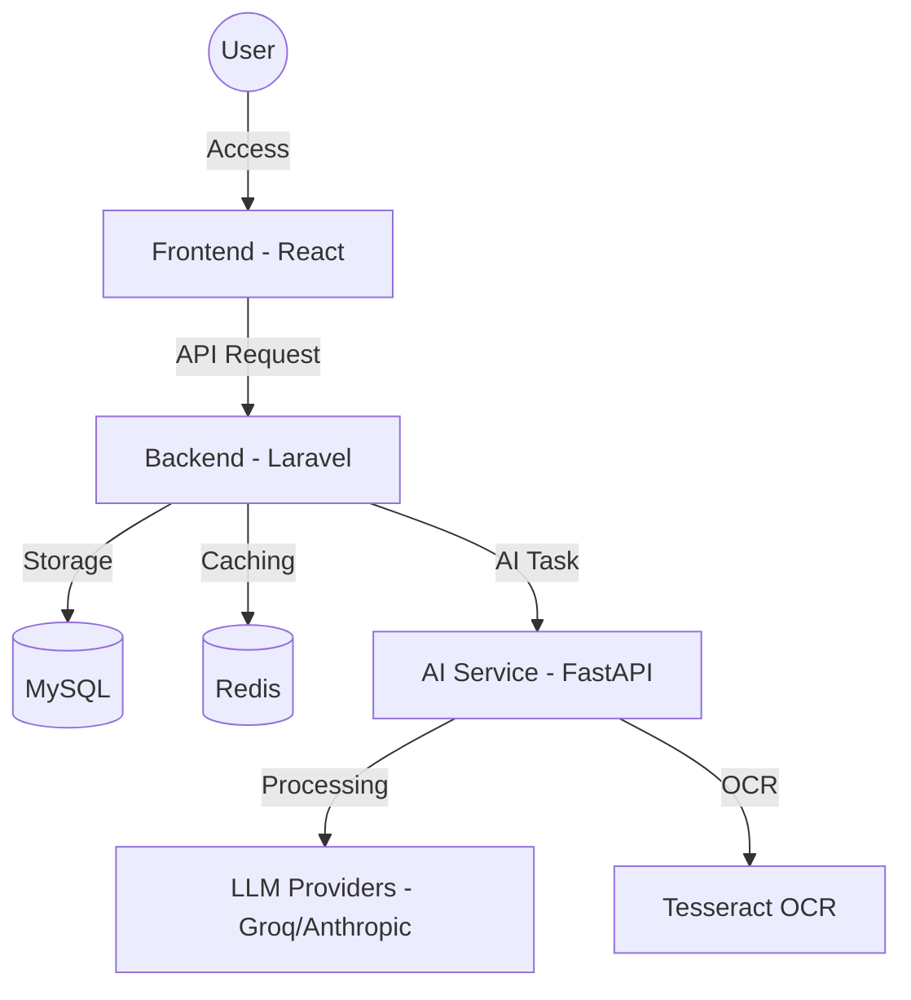

# 🌌 ChatID / Architect AI Platform

ChatID là một nền tảng AI hội thoại hiện đại, kết hợp giữa giao diện chat thông minh và hệ thống quản trị (Dashboard) mạnh mẽ. Dự án được thiết kế để cung cấp trải nghiệm AI mượt mà, hỗ trợ đa mô hình và tích hợp sâu vào quy trình làm việc của người dùng.

---

## 🚀 Giới thiệu Dự án

ChatID không chỉ là một ứng dụng chat đơn thuần. Đây là một hệ sinh thái hoàn chỉnh bao gồm:

- **Giao diện Chat Premium**: Hỗ trợ Markdown, Code highlighting, upload file/ảnh và tìm kiếm web thời gian thực.
- **Hệ thống Dashboard**: Theo dõi hiệu suất, lưu lượng sử dụng và phân tích hành vi người dùng bằng biểu đồ trực quan.
- **Quản lý AI linh hoạt**: Cho phép cấu hình nhiều nhà cung cấp AI (Groq, Anthropic, ...) và quản lý API Keys dễ dàng.
- **Tối ưu hóa hiệu suất**: Sử dụng Redis để caching và đảm bảo tốc độ phản hồi nhanh nhất.

---

## 🏗️ Cấu trúc Hệ thống

Hệ thống được xây dựng theo kiến trúc Microservices đơn giản, tách biệt giữa giao diện, nghiệp vụ và xử lý AI.

### Sơ đồ kiến trúc (High-Level)



### Chi tiết các thành phần:

1.  **Frontend (React)**:
    - Uses React combined with modern UI libraries.
    - Manages application state, displays messages, and dashboard charts.
2.  **Backend (Laravel)**:
    - Acts as an API Gateway and handles core business logic (Auth, Database, Logging).
    - Manages access control (Sanctum) and coordinates requests to the AI Service.
3.  **AI Service (FastAPI)**:
    - A high-performance Python service specialized in processing AI tasks.
    - Integrates LangChain/LlamaIndex to interact with LLMs.
    - Supports file processing, image processing (OCR), and web scraping.

---

## 🔄 How It Works?

### 1. Message Processing Flow (Chat Flow)

- **Step 1**: User sends a message from the Frontend.
- **Step 2**: Backend receives the request, checks permissions, and saves the message to MySQL.
- **Step 3**: Backend sends the request to the AI Service via HTTP protocol.
- **Step 4**: AI Service processes the content (OCR for files or web search if needed), then calls the LLM API.
- **Step 5**: Results are returned through AI Service -> Backend -> Frontend and displayed to the user.

### 2. Dashboard Data Flow

- All user activities (sending messages, logging in, changing settings) are recorded by the Backend in `activity_logs`.
- When the user accesses the Dashboard, the Backend calculates metrics (Response Time, Success Rate, ...) and returns data for ApexCharts on the Frontend.

---

## 🛠️ Environment Requirements

- **PHP**: 8.2+ (Composer included)
- **Node.js**: 18+ (npm or yarn)
- **Python**: 3.10+ (pip)
- **Database**: MySQL 8.0+ & Redis
- **Additional Tools**: Tesseract OCR (if using OCR), Docker (optional)

---

## 💻 Installation Guide

### Method 1: Quick Run with Docker (Recommended)

````bash
=======
Additional tools:

Composer
npm / yarn
Tesseract OCR (optional for OCR features)
💻 Installation Guide
Option 1: Docker Setup (Recommended)
>>>>>>> a0de1c232751a7d7532c6aec6ccb9225d7e8e6c7
docker-compose up --build

Hệ thống sẽ tự động khởi tạo Frontend (3000), Backend (8000) và AI Service (8001).

### Method 2: Manual Installation on Windows

We provide utility scripts to help you get started quickly:

1.  **Install Dependencies**:
    ```bash
    # Run setup script (if available) or install manually:
    cd BackEnd && composer install
    cd ../frontend && npm install
    cd ../ai_service && pip install -r requirements.txt
    ```
2.  **Configure .env**: Copy the `.env.example` files to `.env` in all 3 directories and fill in the necessary information (API Keys, Database config).
3.  **Launch**:
    ```bash
    # Use the combined script
    .\start-all.bat
    ```

---

## 📊 Thông số Cổng (Default Ports)

| Thành phần      | URL / Port                           |
| :-------------- | :----------------------------------- |
| **Frontend**    | `http://localhost:3000`              |
| **Backend API** | `http://localhost:8000`              |
| **AI Service**  | `http://localhost:8001`              |
| **MySQL**       | `3306` (hoặc `3307` nếu dùng Docker) |
| **Redis**       | `6379`                               |

---

## 📝 Giấy phép

Dự án được phát triển bởi **Architect AI Team**. Vui lòng liên hệ để biết thêm chi tiết về bản quyền.
````
