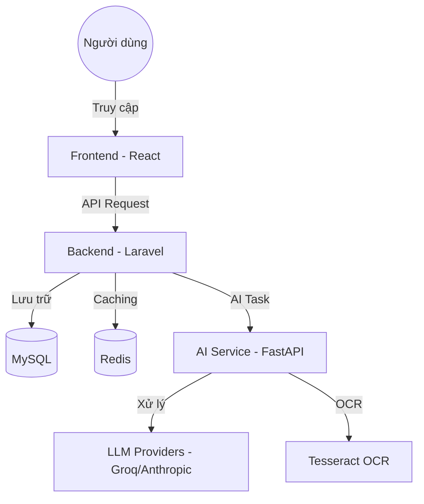

# 🌌 ChatID / Architect AI Platform

ChatID là một nền tảng AI hội thoại hiện đại, kết hợp giữa giao diện chat thông minh và hệ thống quản trị (Dashboard) mạnh mẽ. Dự án được thiết kế để cung cấp trải nghiệm AI mượt mà, hỗ trợ đa mô hình và tích hợp sâu vào quy trình làm việc của người dùng.

---

## 🚀 Giới thiệu Dự án

ChatID không chỉ là một ứng dụng chat đơn thuần. Đây là một hệ sinh thái hoàn chỉnh bao gồm:

- **Giao diện Chat Premium**: Hỗ trợ Markdown, Code highlighting, upload file/ảnh và tìm kiếm web thời gian thực.
- **Hệ thống Dashboard**: Theo dõi hiệu suất, lưu lượng sử dụng và phân tích hành vi người dùng bằng biểu đồ trực quan.
- **Quản lý AI linh hoạt**: Cho phép cấu hình nhiều nhà cung cấp AI (Groq, Anthropic, ...) và quản lý API Keys dễ dàng.
- **Tối ưu hóa hiệu suất**: Sử dụng Redis để caching và đảm bảo tốc độ phản hồi nhanh nhất.

---

## 🏗️ Cấu trúc Hệ thống

Hệ thống được xây dựng theo kiến trúc Microservices đơn giản, tách biệt giữa giao diện, nghiệp vụ và xử lý AI.

### Sơ đồ kiến trúc (High-Level)



### Chi tiết các thành phần:

1.  **Frontend (React)**:
    - Sử dụng React kết hợp với các thư viện UI hiện đại.
    - Quản lý trạng thái ứng dụng, hiển thị tin nhắn và biểu đồ dashboard.
2.  **Backend (Laravel)**:
    - Đóng vai trò là API Gateway và xử lý nghiệp vụ chính (Auth, Database, Logging).
    - Quản lý quyền truy cập (Sanctum) và điều phối các yêu cầu đến AI Service.
3.  **AI Service (FastAPI)**:
    - Một dịch vụ Python hiệu suất cao chuyên xử lý các tác vụ AI.
    - Tích hợp LangChain/LlamaIndex để tương tác với LLMs.
    - Hỗ trợ xử lý file, hình ảnh (OCR) và web scraping.

---

## 🔄 Hoạt động như thế nào?

### 1. Luồng xử lý tin nhắn (Chat Flow)

- **Bước 1**: Người dùng gửi tin nhắn từ Frontend.
- **Bước 2**: Backend nhận yêu cầu, kiểm tra quyền và lưu tin nhắn vào MySQL.
- **Bước 3**: Backend gửi yêu cầu đến AI Service qua giao thức HTTP.
- **Bước 4**: AI Service xử lý nội dung (nếu có file sẽ OCR hoặc tìm kiếm web), sau đó gọi API của LLM.
- **Bước 5**: Kết quả trả về qua AI Service -> Backend -> Frontend và hiển thị cho người dùng.

### 2. Luồng dữ liệu Dashboard

- Mọi hoạt động của người dùng (gửi tin nhắn, đăng nhập, đổi cài đặt) đều được Backend ghi lại vào `activity_logs`.
- Khi người dùng vào Dashboard, Backend sẽ tính toán các chỉ số (Response Time, Success Rate, ...) và trả về dữ liệu cho các biểu đồ ApexCharts trên Frontend.

---

## 🛠️ Yêu cầu Môi trường

- **PHP**: 8.2+ (Composer đi kèm)
- **Node.js**: 18+ (npm hoặc yarn)
- **Python**: 3.10+ (pip)
- **Database**: MySQL 8.0+ & Redis
- **Công cụ bổ sung**: Tesseract OCR (nếu dùng OCR), Docker (tùy chọn)

---

## 💻 Hướng dẫn Cài đặt

### Cách 1: Chạy nhanh bằng Docker (Khuyên dùng)

```bash
docker-compose up --build
```

Hệ thống sẽ tự động khởi tạo Frontend (3000), Backend (8000) và AI Service (8001).

### Cách 2: Cài đặt thủ công trên Windows

Chúng tôi cung cấp các script tiện ích để bạn bắt đầu nhanh chóng:

1.  **Cài đặt Dependencies**:
    ```bash
    # Chạy script setup (nếu có) hoặc cài thủ công:
    cd BackEnd && composer install
    cd ../frontend && npm install
    cd ../ai_service && pip install -r requirements.txt
    ```
2.  **Cấu hình .env**: Sao chép các file `.env.example` thành `.env` trong cả 3 thư mục và điền thông tin cần thiết (API Keys, Database config).
3.  **Khởi chạy**:
    ```bash
    # Sử dụng script tổng hợp
    .\start-all.bat
    ```

---

## 📊 Thông số Cổng (Default Ports)

| Thành phần      | URL / Port                           |
| :-------------- | :----------------------------------- |
| **Frontend**    | `http://localhost:3000`              |
| **Backend API** | `http://localhost:8000`              |
| **AI Service**  | `http://localhost:8001`              |
| **MySQL**       | `3306` (hoặc `3307` nếu dùng Docker) |
| **Redis**       | `6379`                               |

---

## 📝 Giấy phép

Dự án được phát triển bởi **Architect AI Team**. Vui lòng liên hệ để biết thêm chi tiết về bản quyền.
